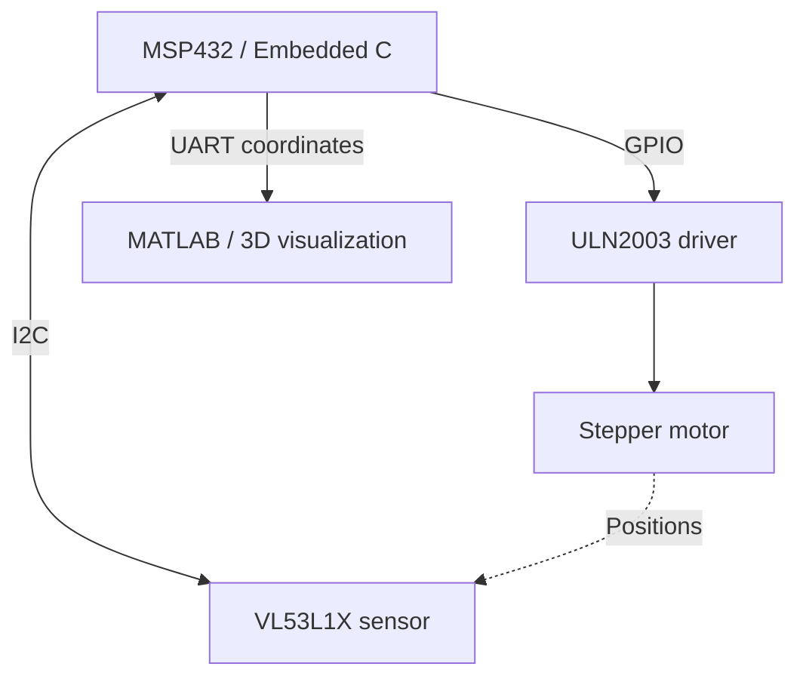

# MSP432 3D Spatial Mapping System

An embedded scanning system that combines time-of-flight distance measurements, stepper motor control, and MATLAB visualization to reconstruct the surrounding environment.

## Overview

This project uses an MSP432 microcontroller to coordinate a VL53L1X time-of-flight sensor mounted on a stepper motor. Embedded C firmware collects distance measurements at fixed angular positions, converts the measurements to Cartesian coordinates, and sends the results to a PC through UART.

MATLAB receives the coordinate data and combines multiple scan slices into a 3D visualization. The device is manually repositioned between full scans to capture the environment at different locations.

**Author:** Sam Chan

## Key Features

- **360-degree scanning** with 32 measurements per scan at 11.25-degree intervals.
- **Three scan passes**, producing 96 measured points across separate positions.
- **I2C sensor acquisition** and GPIO-controlled stepper motor positioning.
- **Embedded C firmware** with SysTick timing and onboard button/LED feedback.
- **UART communication at 115200 bps** with a MATLAB handshake before data transfer.
- **MATLAB 3D visualization** using measured points and connected scan profiles.

## Hardware Platform

<!-- PHOTO PLACEHOLDER: Upload a photo of your complete scanner to docs/images/scanner-setup.jpg, or replace the path below with your own filename. -->

*MSP432 development board, sensor mount, stepper motor, and driver connections.*

| Component | Role |
| --- | --- |
| MSP432E401Y development board | Sensor acquisition, scan sequencing, coordinate conversion, and serial communication |
| VL53L1X time-of-flight sensor | Measures distance to surrounding surfaces through I2C |
| Stepper motor | Rotates the sensor through fixed angular increments |
| ULN2003 motor driver | Drives the stepper motor from microcontroller control signals |
| PC running MATLAB | Receives coordinates and displays the reconstructed environment |

## System Architecture

## How It Works

1. **Initialize:** Configure the clock, GPIO, SysTick, I2C, and UART, then wait for the sensor to finish booting.
2. **Acquire a scan:** Start a scan with onboard button PJ0. At each angular position, wait for a fresh sensor reading, store the distance and angle, and advance the motor.
3. **Repeat at different positions:** Manually move the device between full rotations to collect three scan slices.
4. **Convert and transmit:** Convert the stored polar measurements to planar Cartesian coordinates in the firmware, then transfer the coordinates to MATLAB over UART.
5. **Visualize:** MATLAB separates the slices using their scan-position offsets and plots the measured points and connecting lines to form a 3D view.

## Wiring Diagram

<!-- IMAGE PLACEHOLDER: Upload your circuit/wiring diagram to docs/images/wiring-diagram.png. -->

*The full report contains the pin assignments and hardware connections used in this build.*

## Results

The scanner was tested in a hallway at McMaster University. MATLAB visualizations were compared with photographs of the scanned space to assess how the measured profiles represented the hallway shape and nearby objects.

<!-- PHOTO PLACEHOLDER: Upload a photo of the scanned environment to docs/images/scanned-environment.jpg. -->

*The physical environment used for the scan.*

<!-- IMAGE PLACEHOLDER: Upload your MATLAB plot to docs/images/matlab-reconstruction.png. -->

*Reconstructed scan slices displayed in MATLAB.*

## Software and Tools

- Embedded C
- Keil uVision
- MATLAB
- I2C, UART, GPIO, and SysTick

## Running the Project

1. Connect the sensor and motor driver according to the wiring diagram and full report.
2. Connect the MSP432 board to the PC and identify its application UART COM port.
3. Open the firmware project in Keil uVision, build it, and load it onto the board.
4. Set the MATLAB script's serial port to the correct COM port and confirm a baud rate of **115200**.
5. Reset the board and run the MATLAB script before starting acquisition.
6. Use PJ0 to initiate scanning, repositioning the device between scan passes.
7. Allow coordinate transfer to complete and inspect the MATLAB reconstruction.

## Testing and Limitations

- Motor stepping delays were evaluated to balance scanning speed with reliable rotation and reduce missed steps or stalling.
- Clock timing was checked using a GPIO output and a known SysTick delay.
- Serial setup requires matching COM-port and baud-rate settings between the board and MATLAB.
- The 11.25-degree angular spacing produces a relatively sparse reconstruction; small features may fall between sampled directions.
- Manual repositioning makes consistent spacing and alignment important when combining scan slices.

## Full Documentation

The complete report covers system design, hardware connections, firmware and MATLAB flowcharts, operating instructions, testing, and results.

<!-- REPORT PLACEHOLDER: Upload your full report to docs/msp432-scanner-report.pdf, or replace the filename below with the actual PDF filename. -->

[Read the full project report (PDF)](docs/msp432-scanner-report.pdf)

## References and Resources

- [Texas Instruments: MSP432E401Y documentation](https://www.ti.com/product/MSP432E401Y)
- [STMicroelectronics: VL53L1X documentation](https://www.st.com/en/imaging-and-photonics-solutions/vl53l1x.html)

Additional references are included in the full project report. See source-file author notices for supplied drivers and supporting code.
